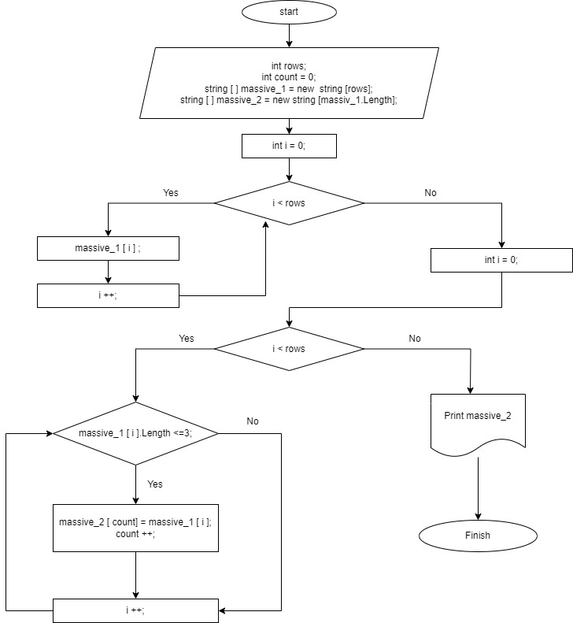

# Задание
1. Создать репозиторий на GitHub
2. Нарисовать блок-схему алгоритма (можно обойтись блок-схемой основной содержательной части, если вы выделяете её в отдельный метод)
3. Снабдить репозиторий оформленным текстовым описанием решения (файл README.md)
4. Написать программу, решающую поставленную задачу
5. Использовать контроль версий в работе над этим небольшим проектом (не должно быть так, что всё залито одним коммитом, как минимум этапы 2, 3, и 4 должны быть расположены в разных коммитах)

Задача: Написать программу, которая из имеющегося массива строк формирует новый массив из строк, длина которых меньше, либо равна 3 символам. Первоначальный массив можно ввести с клавиатуры, либо задать на старте выполнения алгоритма. При решении не рекомендуется пользоваться коллекциями, лучше обойтись исключительно массивами.

# Решение 
1. Выбран способ создания нового репозитория в Github - загрузка файла "Контрольная работа" с локального диска.
2. Блок схема алгоритма решения задачи:
   - Создана блок-схема в программе drow.io.
   - Блок схема экспортирована на локальный диск и добавлена в gitignore 
   
3. 
4. Создана программа Решающая задачу
5. Обновление репозитория было на этапах 1 (создан), 4, 2, 3.