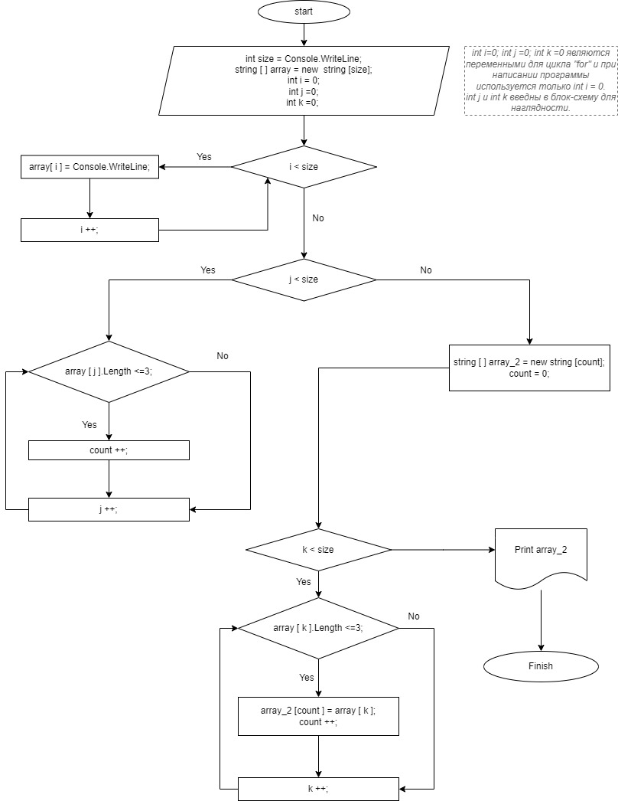

# Задание
1. Создать репозиторий на GitHub
2. Нарисовать блок-схему алгоритма (можно обойтись блок-схемой основной содержательной части, если вы выделяете её в отдельный метод)
3. Снабдить репозиторий оформленным текстовым описанием решения (файл README.md)
4. Написать программу, решающую поставленную задачу
5. Использовать контроль версий в работе над этим небольшим проектом (не должно быть так, что всё залито одним коммитом, как минимум этапы 2, 3, и 4 должны быть расположены в разных коммитах)

Задача: Написать программу, которая из имеющегося массива строк формирует новый массив из строк, длина которых меньше, либо равна 3 символам. Первоначальный массив можно ввести с клавиатуры, либо задать на старте выполнения алгоритма. При решении не рекомендуется пользоваться коллекциями, лучше обойтись исключительно массивами.

# Решение 
1. Выбран способ создания нового репозитория в Github - загрузка файла "Контрольная работа" с локального диска.
2. Блок схема алгоритма решения задачи:
   - Создана блок-схема в программе drow.io.
   - Блок схема экспортирована на локальный диск и добавлена в gitignore 
   
3. Алгоритм-решения:
- Задается размер __*size*__, определяющий количество строк массива 1.
- Создается новый **массив 1** __*array*__ с размером __*size*__.
- Запускается цикл __*for*__ для ручного ввода значений элементов массива __*array*__ *(Значения могут быть как текcтовыми, так и числовыми)*.
- Вводится переменная __*count*__, которая будет определять размерность **массива 2**:
- Запускается цикл __*for*__, перебирающий значения **массива 1**, с использованием переменной __*i*__, 
  - Запускается условие __*if*__, проверяющее длину элементов массива 1. 
    - Если длина элементов **массива 1** меньше или равна трём символам, то счетчик __*count*__ увеличивается на 1 и переменная __*i*__ увеличивается на 1;
    - Если длина элементов **массива 1** больше трёх символов, то переменная __*i*__ увеличивается на 1;
- Создаем массив 2 с размерностью __*count*__ и обнуляем переменную __*count*__, чтобы использовать ее дальше как счетчик;
- Запускается цикл __*for*__, перебирающий значения массива 1, с использованием переменной __*i*__, 
  - Запускается условие __*if*__, проверяющее длину элементов **массива 1**. 
    - Если длина элементов массива 1 меньше или равна трём символам, присваиваем элементу **массива 2** значение элемента **массива 1**, счетчик __*count*__ увеличивается на 1 и переменная __*i*__ увеличивается на 1;
    - Если длина элементов массива 1 больше трёх символов, то переменная __*i*__ увеличивается на 1;
- Выводим **массив 2** на печать.
4. Создана программа Решающая задачу
5. Обновление репозитория было на этапах 1 (создан), 4, 2, 3.